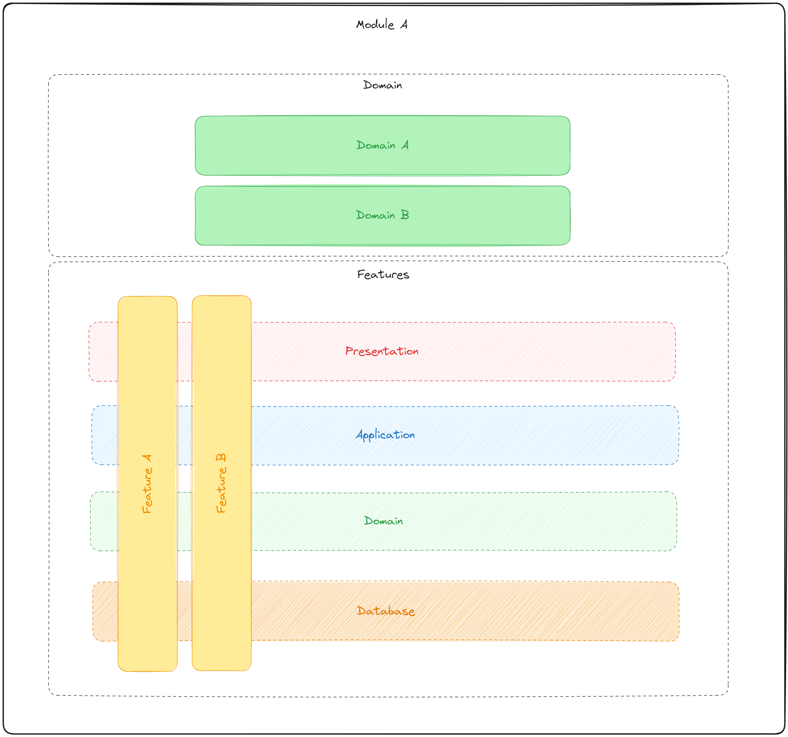

<div align="center">
    <image src="./doc/rust_1.png" width="261" />
    <h1 align="center">
     <a href="#" alt="site do places"> Template Vertical Slice com Rust</a>
     </h1>
</div>

<h3 align="center">
    🦀 O template para o bootstrap da sua aplicação Rust. ❤️
</h3>

# Tabela de conteúdos

<!--ts-->

- [Sobre o projeto](#-sobre-o-projeto)
- [Funcionalidades](#%EF%B8%8F-funcionalidades)
- [Como executar o projeto](#-como-executar-o-projeto)
  - [Pré-requisitos](#pré-requisitos)
  - [Rodando o projeto](#-rodando-o-projeto)
- [Tecnologias](#-tecnologias)
  - [Template](#template-rust)
- [Estrutura do Projeto](#-estrutura-do-projeto)
- [Autor](#-autor)
- [Licença](#-licença)
<!--te-->

## 💻 Sobre o projeto

Esse projeto tem como intuíto exemplificar como pode ser criado o seu projeto com Rust utilizando conceitos da arquitetura Vertical Slice junto com Domain-Driven Design e arquitetura modular. 

<div align="center">
    <image src="./doc/rust_2.png" width="261" />
</div>

---

## ⚙️ Funcionalidades

- [x] Vertical Slice
- [x] HTTP Routes
- [x] Asynchronous communication
- [x] Dependency Injection
- [x] Exception Filter
- [x] Postgres Integration
- [x] OpenApi Integration
- [x] Logs
- [x] Tests

---

## 🚀 Como executar o projeto

### Pré-requisitos

Antes de começar, você vai precisar ter instalado em sua máquina as seguintes ferramentas:
[Git](https://git-scm.com), [Rust](https://www.rust-lang.org/tools/install), [Docker](https://docs.docker.com/engine/install/).
Além disto é bom ter um editor para trabalhar com o código como [VSCode](https://code.visualstudio.com/)

#### 🎲 Rodando o projeto

```bash

# Clone este repositório
$ git@github.com:andrewronscki/template_rust_vertical_slice.git

# Acesse a pasta do projeto no terminal/cmd
$ cd template_rust_vertical_slice

# Crie a infra com docker compose
# Garanta que o docker esteja rodando
$ make infra

# Após a infra ser criada inicie o projeto
$ make run

# Para mais comandos visite o arquivo Makefile

```

<div align="center">
    <image src="./doc/rust_3.png" width="261" />
</div>


---

## 🛠 Tecnologias

As seguintes ferramentas foram usadas na construção do projeto:

#### [](https://github.com/andrewronscki/places-serverside)**Template** ([Rust](https://www.rust-lang.org/))

- **[Axum](https://crates.io/crates/axum)**
- **[Tokio](https://crates.io/crates/tokio)**
- **[Serde](https://crates.io/crates/serde)**
- **[Serde Json](https://crates.io/crates/serde_json)**
- **[Diesel](https://crates.io/crates/diesel)**
- **[Dotenv](https://crates.io/crates/dotenv)**
- **[This Error](https://crates.io/crates/thiserror)**
- **[Tower Http](https://crates.io/crates/tower-http)**
- **[Waiter DI](https://crates.io/crates/waiter_di)**
- **[Once Cell](https://crates.io/crates/once_cell)**
- **[Utoipa](https://crates.io/crates/utoipa)**
- **[Utoipa Swagger UI](https://crates.io/crates/utoipa-swagger-ui)**
- **[Lapin](https://crates.io/crates/lapin)**
- **[Futures Util](https://crates.io/crates/futures-util)**
- **[Log](https://crates.io/crates/log)**
- **[Env Logger](https://crates.io/crates/env_logger)**

> Veja o arquivo [Cargo.toml](https://github.com/andrewronscki/template_rust_vertical_slice/blob/main/Cargo.toml)

---

## 🛠 Estrutura do Projeto

A estrutura do template do projeto segue este modelo:

- O sistema deve ser desenvolvido utilizando os ensinamentos do Vertical Slice e Domain-Driven Design, separando as camadas em domain e features;
- O sistema deve ser agrupado por módulos independentes;
- O desenvolvimento dos domínios devem ser orientado a testes (TDD).

<div align="center">
  
</div>

---

## 🦸 Autor

<a href="https://andrewronscki.com" style="margin: 0px; padding:0;">
 
 <br />
 <sub><b>André Wronscki Ricardo</b></sub></a> <a href="https://andrewronscki.com" title="André Wronscki">🚀</a>
 <br />
 <br />

[](https://www.linkedin.com/in/andr%C3%A9-wronscki-ricardo-13694bb7/)
[](mailto:andrewronscki@gmail.com)

---

## 📝 Licença

Este projeto esta sobe a licença [MIT](./LICENSE.md).
